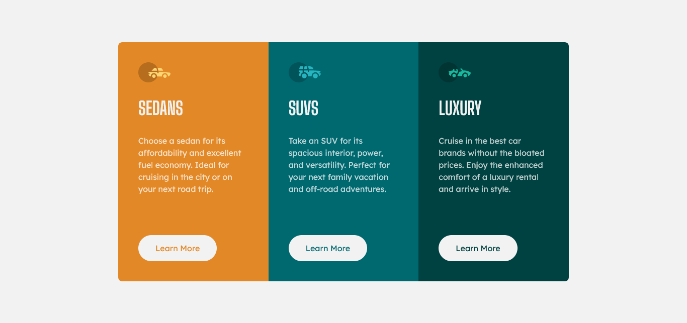

# Frontend Mentor - 3-column preview card component solution

This is a solution to the [3-column preview card component challenge on Frontend Mentor](https://www.frontendmentor.io/challenges/3column-preview-card-component-pH92eAR2-). Frontend Mentor challenges help you improve your coding skills by building realistic projects.

## Overview

### The challenge

Users should be able to:

- View the optimal layout depending on their device's screen size
- See hover states for interactive elements

### Screenshot

### Links

[Live site](https://matheu46.github.io/three-column-preview-card-component/)

## My process

### Built with

- TailwindCSS
- CSS Grid
- Mobile-first workflow

### What I learned

It was my first time using tailwind, it's an easy library to learn, if you know CSS you probably won't have much trouble using it. They have a great documentation!
https://tailwindcss.com/docs/installation

## Author

- Frontend Mentor - [@matheu46](https://www.frontendmentor.io/profile/matheu46)
